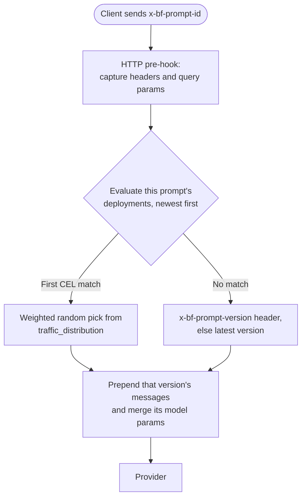
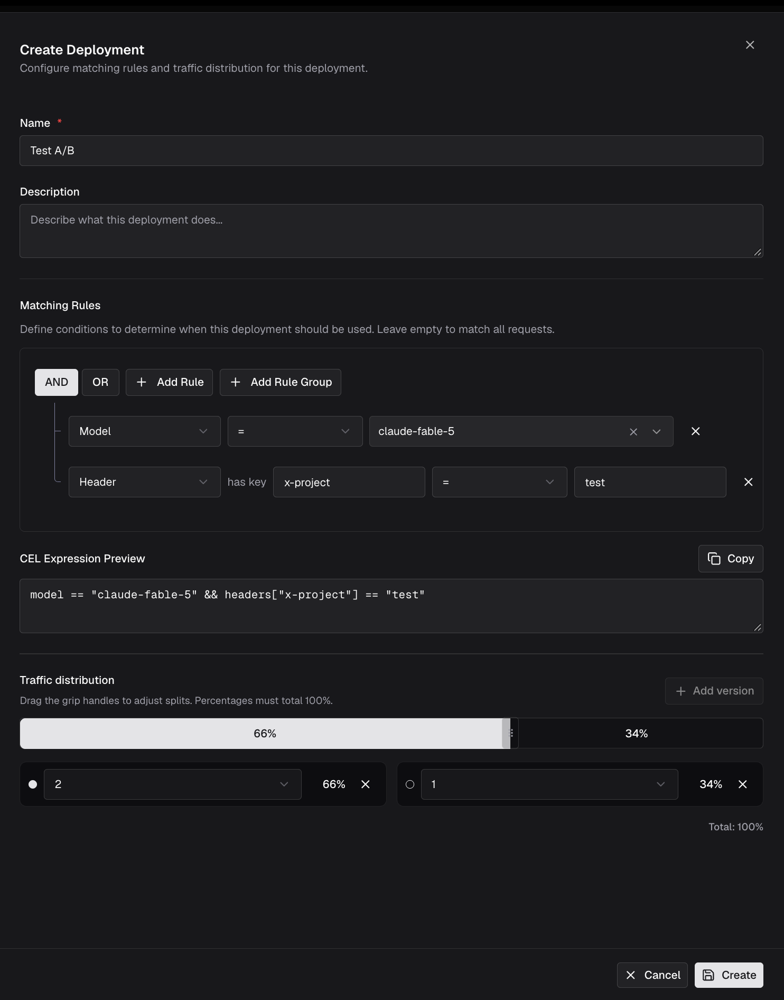

## Overview

A **prompt deployment** is a rule attached to a single prompt in the [Prompt Repository](/features/prompt-repository/playground) that decides **which committed version** of that prompt serves a request. Each deployment pairs a **matching rule** (a CEL expression over request attributes) with a **traffic distribution** (a weighted split across version numbers).

This lets you ship a prompt change without changing any client code: callers keep sending the same prompt ID, and the gateway picks the version.

**What it enables:**

- **A/B testing** - split traffic 50/50 (or any ratio) across two committed versions and compare them in logs.
- **Staged rollout** - start a new version at 10%, widen as it proves out.
- **Conditional versions** - serve a different version per model, per provider, per request type, or per request header.

<Info>
Prompt deployments are part of the Bifrost **enterprise** license. Open-source Bifrost ships the Prompt Repository and the [prompts plugin](/features/prompt-repository/prompts-plugin), where the caller picks the version explicitly with the `x-bf-prompt-version` header. Server-side version selection is what enterprise adds.
</Info>

---

## How it works

Deployments do not change how a prompt is selected - the request still names the prompt with the `x-bf-prompt-id` header. They only change **which version** of that prompt is injected.



Resolution, in order:

1. **No `x-bf-prompt-id` header** - the plugin does nothing and the request passes through untouched.
2. **Deployments for that prompt are evaluated newest-first** (by creation time, descending). A deployment with an empty traffic distribution is skipped entirely.
3. **The first deployment whose CEL expression matches wins.** Evaluation stops there - later deployments are not consulted.
4. **A version is drawn from that deployment's traffic distribution** by weighted random selection. Entries at `0%` are never drawn.
5. **If no deployment matches**, the plugin falls back to the `x-bf-prompt-version` header, and if that is absent, to the prompt's latest committed version.

<Note>
A matching deployment **overrides** the `x-bf-prompt-version` header. The header is only honoured when no deployment matches the request.
</Note>

---

## Prerequisites

- An enterprise Bifrost deployment with a **config store that holds the Prompt Repository tables** (typically PostgreSQL).
- A prompt with **at least two committed versions** - deployments route between version numbers, so there is nothing to split until you have committed more than one.
- The `enterprise-prompts` plugin, which is initialized automatically by the enterprise gateway. There is no `config.json` section for deployments; they are stored in the database and managed through the UI or the API.

---

## Creating a deployment

<Tabs group="config-method">
<Tab title="Web UI">

1. Open the **Prompt Repository** and select the prompt you want to route. Deployments are scoped to one prompt, so the panel is empty until a prompt is open.
2. In the right-hand settings panel, expand the **Deployments** section.
3. Click **Add** to open the deployment sheet.
4. Enter a **Name** (required, and unique across all prompts) and an optional **Description**.
5. Under **Matching Rules**, build the condition that selects this deployment with **Add Rule** and **Add Rule Group**, combining clauses with **AND** or **OR**. The **CEL Expression Preview** below the builder shows the expression that will actually be saved. Leave the builder empty to match every request for this prompt.
6. Under **Traffic distribution**, click **Add version** for each version you want in the split, pick the version number, and drag the grip handles on the bar to set percentages. The total must be exactly **100%**, and a version can appear only once.
7. Click **Create**.



Existing deployments are listed in the panel with their traffic bar; expand a row to see its full expression, or use the pencil and trash icons to edit or delete it.

</Tab>
<Tab title="API">

**Create a deployment:**

```bash
curl -X POST http://localhost:8080/api/prompt-repo/deployments \
  -H "Content-Type: application/json" \
  -d '{
    "prompt_id": "9f1c1b6e-1f2a-4a1e-9a77-2b6b5e0f4d21",
    "name": "gpt-4o canary",
    "description": "Send 10% of gpt-4o chat traffic to v3",
    "cel_expression": "model == \"gpt-4o\" && request_type == \"chat_completion\"",
    "traffic_distribution": [
      { "version": "2", "percentage": 90 },
      { "version": "3", "percentage": 10 }
    ]
  }'
```

**Response (`201 Created`):**

```json
{
  "id": "1f7a5c2c-9d1b-4f0e-b3a4-7c6a2f9e8d10",
  "prompt_id": "9f1c1b6e-1f2a-4a1e-9a77-2b6b5e0f4d21",
  "name": "gpt-4o canary",
  "description": "Send 10% of gpt-4o chat traffic to v3",
  "cel_expression": "model == \"gpt-4o\" && request_type == \"chat_completion\"",
  "traffic_distribution": [
    { "version": "2", "percentage": 90 },
    { "version": "3", "percentage": 10 }
  ],
  "created_at": "2026-09-22T10:04:11Z",
  "updated_at": "2026-09-22T10:04:11Z"
}
```

| Field | Type | Required | Description |
|-------|------|----------|-------------|
| `prompt_id` | string | Yes | ID of the prompt this deployment routes. Create only. |
| `name` | string | Yes | Display name. Unique across **all** deployments, not just this prompt. |
| `description` | string | No | Free text shown in the deployments list. |
| `cel_expression` | string | No | Matching rule. Empty or `true` matches every request for the prompt. Validated and compiled on save. |
| `query` | object | No | The rule-builder representation of the expression. The UI sends it so it can re-open the visual builder; it is not evaluated at request time. |
| `traffic_distribution` | array | No | Entries of `{ "version": "<number as string>", "percentage": <int> }`. Percentages must sum to exactly `100`. A deployment without one never matches. |

**Endpoints:**

| Method | Path | Description |
|--------|------|-------------|
| `GET` | `/api/prompt-repo/deployments?prompt_id=<id>` | List deployments. Omit `prompt_id` to list all. |
| `GET` | `/api/prompt-repo/deployments/{id}` | Fetch one deployment. |
| `POST` | `/api/prompt-repo/deployments` | Create a deployment. |
| `PUT` | `/api/prompt-repo/deployments/{id}` | Replace name, description, expression, and distribution. |
| `DELETE` | `/api/prompt-repo/deployments/{id}` | Delete a deployment. |

**Errors:**

| Status | Body | Cause |
|--------|------|-------|
| `400` | `prompt_id is required` / `name is required` | Missing required field. |
| `400` | `CEL compile error: ...` | The expression does not compile against the available variables. |
| `400` | `traffic distribution percentages must sum to 100` | Percentages do not total 100. |
| `400` | `traffic distribution percentage must be between 0 and 100` | An entry is out of range. |
| `409` | `a deployment with that name already exists` | The name is taken. |
| `404` | `deployment not found` | Unknown ID, or a prompt outside your [data access control](/enterprise/data-access-control) scope. |

</Tab>
</Tabs>

---

## Matching rules

Matching rules are [CEL](https://github.com/google/cel-spec) expressions, the same language used by [routing rules](/features/governance/routing). An expression must evaluate to a boolean. These variables are available:

| Variable | Type | Description |
|----------|------|-------------|
| `model` | string | Model on the request, e.g. `gpt-4o`. |
| `provider` | string | Provider on the request, e.g. `openai`. |
| `request_type` | string | Normalized request type, e.g. `chat_completion`, `chat_completion_stream`, `responses`, `text_completion`. Streaming and non-streaming are distinct values. |
| `headers` | map(string, string) | Request headers. Keys are lowercased. |
| `params` | map(string, string) | Query parameters. Keys are lowercased. |
| `tokens_used` | double | Token usage as a percentage of the applicable limit. |
| `request` | double | Request-count usage as a percentage of the applicable limit. |
| `budget_used` | double | Budget usage as a percentage of the applicable limit. |

Examples:

```javascript
// Everything for this prompt
true

// One model, non-streaming chat only
model == "gpt-4o" && request_type == "chat_completion"

// Internal callers, identified by a header
headers["x-team"] == "growth"

// Anthropic traffic when the budget is nearly exhausted
provider == "anthropic" && budget_used >= 90.0
```

<Note>
Header and query-parameter keys are lowercased both when the expression is saved and when it is evaluated, so `headers["X-Team"]` and `headers["x-team"]` behave identically. Values are matched as-is and are case-sensitive.
</Note>

<Warning>
`tokens_used`, `request`, and `budget_used` are `0.0` unless the [governance](/features/governance/budget-and-limits) plugin is active to supply live usage. Without it, a rule like `budget_used >= 90.0` never matches.
</Warning>

---

## Traffic distribution

The traffic distribution is the weighted split that decides the version once a deployment matches.

- Percentages must sum to **exactly 100**; each entry must be between 0 and 100.
- Each version may appear **at most once** in a distribution.
- Entries at `0%` are excluded from the draw, so you can park a version without removing it.
- The version is chosen by **weighted random selection on every request**.

<Warning>
Selection is per request and stateless - it is **not** sticky per user, session, or conversation. Two consecutive calls from the same client can land on different versions. If a flow depends on the same version across several turns, pin it explicitly with `x-bf-prompt-version` and leave that traffic out of the deployment's matching rule.
</Warning>

A deployment with **no** traffic distribution is inert: it is skipped during resolution even if its expression would match. Give every deployment a distribution, or delete it.

---

## Confirming which version served a request

When a prompt is resolved, the gateway echoes the decision on the response:

| Header | Description |
|--------|-------------|
| `bf-resolved-prompt-id` | The prompt that was injected. |
| `bf-resolved-prompt-version` | The version number that was selected. `0` means the prompt's latest committed version was used. |

These are the fastest way to verify a split is behaving - send a batch of identical requests and count the versions that come back.

---

## Ordering and overlap

Deployments for a prompt are evaluated **newest-first**, and the first match wins. Two consequences are worth planning around:

- A newly created deployment takes precedence over older ones whose rules overlap with it.
- A catch-all deployment (`true`, or an empty expression) shadows every deployment created **before** it. Create catch-alls first, narrow rules after.

---

## Permissions and visibility

Deployments are governed by the `PromptDeploymentStrategy` [RBAC](/enterprise/rbac) resource, with `Create`, `View`, `Update`, and `Delete` operations. In the default roles:

| Role | Permissions |
|------|-------------|
| Admin | Create, View, Update, Delete |
| Developer | Create, View, Update, Delete |
| Viewer | View |

[Data access control](/enterprise/data-access-control) scope is **inherited from the parent prompt**: a deployment attached to a prompt outside your scope is not listed, and fetching it by ID returns `404`.

---

## Clustering

In a [cluster](/enterprise/clustering), every create, update, and delete reloads the local deployment cache, gossips to the other nodes under the `prompt_deployment` entity type, and notifies connected UI clients. CEL expressions are compiled once at cache load, so matching stays off the request path.

---

## Troubleshooting

### My deployment never serves its new version

**Symptom:** `bf-resolved-prompt-version` always comes back as the old version, or as `0`.
**Causes:** the deployment has no traffic distribution; a newer deployment with an overlapping rule is matching first; or the expression does not match the request.
**Fix:** confirm the distribution totals 100%, check whether a more recently created deployment shadows this one, and simplify the expression to `true` temporarily to confirm the rest of the path works.

### Saving the deployment returns a CEL compile error

**Symptom:** `400 CEL compile error: undeclared reference to '<field>'`.
**Cause:** the expression references a variable that is not in the deployment CEL environment.
**Fix:** rewrite the rule using the variables listed under [Matching rules](#matching-rules).

### Versions alternate between requests from the same user

**Symptom:** a multi-turn conversation gets different prompt versions on different turns.
**Cause:** weighted selection is per request and not sticky.
**Fix:** pin the version with `x-bf-prompt-version` for those requests, and exclude them from the deployment's matching rule.

### Budget or usage rules never match

**Symptom:** a rule on `budget_used`, `tokens_used`, or `request` never fires.
**Cause:** governance is not supplying usage data, so all three evaluate to `0.0`.
**Fix:** enable the governance plugin and configure budgets or rate limits for the provider and model in question.

---

## Next steps

- **[Prompt Repository](/features/prompt-repository/playground)** - author prompts, commit versions, and find a prompt's ID.
- **[Prompts plugin](/features/prompt-repository/prompts-plugin)** - how committed versions are injected into requests, and the header contract.
- **[Routing rules](/features/governance/routing)** - the same CEL builder applied to provider and model selection.
- **[RBAC](/enterprise/rbac)** - grant or restrict deployment management per role.
